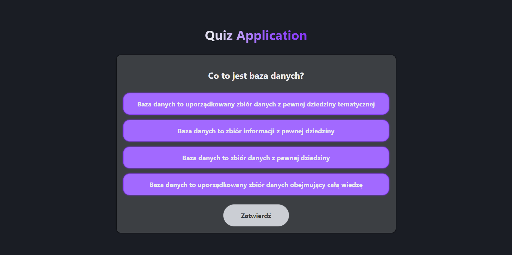
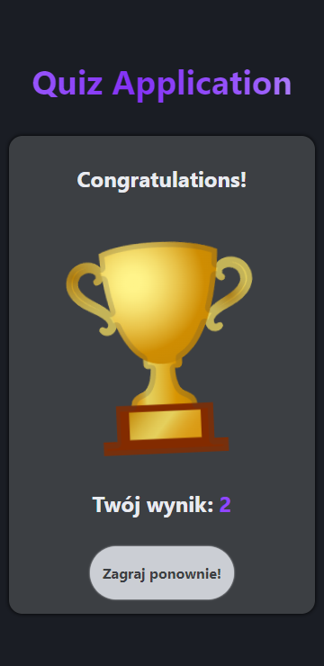

## Live preview - **https://er1v3s.github.io/quiz-app**

# Vanilla JavaScript quiz application project

## Available Scripts

In the project directory run scripts:

### `npm start`

Runs the app in the development mode.\
Open [http://localhost:8080](http://localhost:8080) to view it in your browser.

### `npm run build`

Builds the app for production to the `build` folder.\
It correctly bundles files in production mode and optimizes the build for the best performance.
The build is minified and the filenames include the hashes.\

## Gallery




## Wanna use it in your project?

1. Create your own data for quiz
2. Put your data in the `questions.js` file following this schema:

```
const questions = [
  {
    id: 1,  // question id starting from 1 for every different category
    category: category,     // question sorting is based on category
    question: question,     // question
    answer: {
      0: answer-1,  // first answer
      1: answer-2,  // second answer
      2: answer-3,  // third answer
      3: answer-4,  // fourth answer
    },
    correct_answer: 0, // correct answer
  },
]
```

3. In file `QuizMenu.js`, create buttons for each category

```
<button class="menu__quiz_category" id="category">Category_name</button>

// In id you have to put the category which is the same like category in array
// in `questions.js` file
// And between <button> tags, your category name
```

4. That's all. Enjoy your own quiz!
